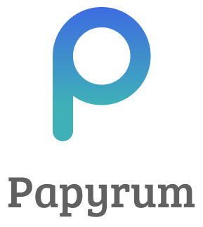
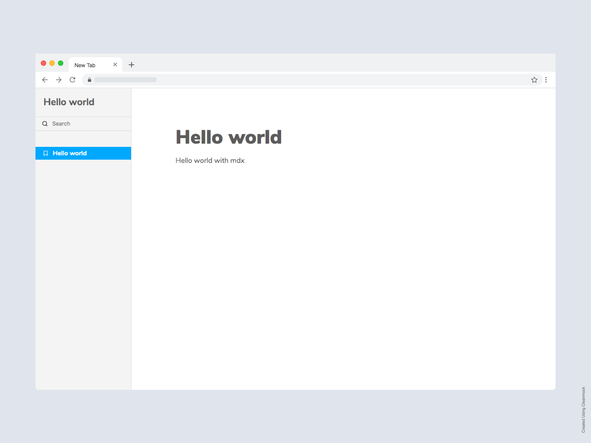

<p align="center">
  
</p>

Papyrum is a tool that will help you in the creation of your design system, style guide or in the documentation of your project based on `react`

### Features

- Zero config
- [MDX based](https://mdxjs.com/), builds documentation with the markdown of the component era.
- Typescript support

### Installation

```bash
npm i @papyrum/cli @papyrum/ui -D -E
```

> You need react y react-dom with 16.8.6 installed.

### Usage

Add the following to your  `package.json`

```json
{
  "name": "my_project",
  "scripts": {
    "dev": "papyrum dev",
    "build": "papyrum build"
  }
}
```

Hello world with papyrum, create one file `.mdx`

```
---
name: Hello world
---

# Hello world

Hello world with mdx
```

execute

```bash
yarn dev
```

<p align="center">
  
</p>

### Examples

- [Basic](https://github.com/wilsson/papyrum/tree/master/examples/basic)
- [With typescript](https://github.com/wilsson/papyrum/tree/master/examples/typescript)